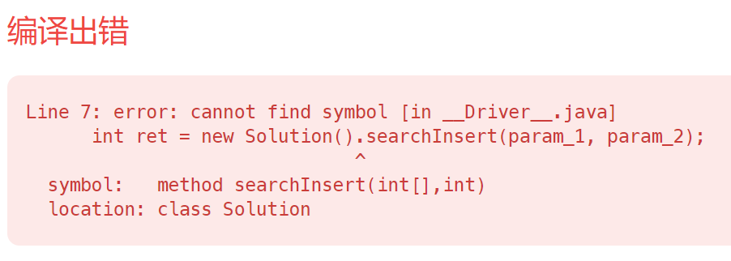

# Day1 35. 搜索插入位置

[题目链接](https://leetcode.cn/problems/search-insert-position/)

题目要求O(lgn)的算法，所以必须使用二分搜索，此题是二分的变形。

需要监控循环退出时最后一轮到底是left还是right发生了改变，如果是left，那就返回left，如果是right，那就返回right+1。

```java
class Solution {
    public int searchInsert(int[] nums, int target) {
        int left = 0;
        int right = nums.length - 1;
        int mid;
        StringBuilder log = new StringBuilder(10000);

        while(left <= right){
            mid = left + (right - left) / 2;
            if(nums[mid] == target){
                return mid;
            } else if(nums[mid] < target){
                left = mid + 1;
                log.append("l");
            } else if(nums[mid] > target){
                right = mid - 1;
                log.append("r");
            }
        }

        if(log.charAt(log.length() - 1) == 'l'){
            return left;
        } else {
            return right + 1;
        }
    }
}
```

无语的错误(ˉ▽ˉ；)...：因为直接从704copy了基础的二分查找而没有更改函数名，报了如下错误



对于需要在循环中不断拼接的字符串，使用StringBuilder而不是String，如果有对线程安全的要求，需要使用带有同步锁的StringBuffer。

进一步观察发现，当循环结束时，其实都是循环条件刚好被破坏的时候，也就是说，此时left一定比right大1，因此不需要对最后一步是更改了left还是right进行判断(lll￢ω￢)

最终版本的代码
```java
class Solution {
    public int searchInsert(int[] nums, int target) {
        int left = 0;
        int right = nums.length - 1;
        int mid;

        while(left <= right){
            mid = left + (right - left) / 2;
            if(nums[mid] == target){
                return mid;
            } else if(nums[mid] < target){
                left = mid + 1;
            } else if(nums[mid] > target){
                right = mid - 1;
            }
        }
        return left; // 与704相比只需改动返回值

    }
}
```